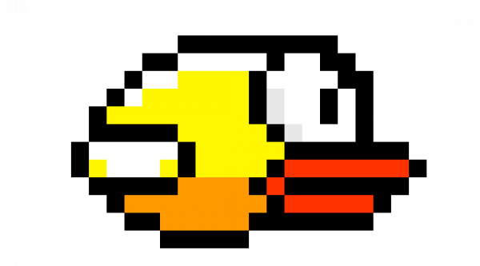

[![Contributors][contributors-shield]][contributors-url]
[![Forks][forks-shield]][forks-url]
[![Stargazers][stars-shield]][stars-url]
[![Issues][issues-shield]][issues-url]

<!-- PROJECT LOGO -->
 

  

<h3 align="center">JS Bird</h3>

  

    Flappy Bird, made with JavaScript.
     
    <a href="https://jakecernet.github.io/JS-Flappy-Bird/" target="_blank"><strong>Play the game »</strong></a>
     
     
    <a href="https://github.com/jakecernet/JS-Flappy-Bird/issues">Report Bug</a>
    ·
    <a href="https://github.com/jakecernet/JS-Flappy-Bird/issues">Request Feature</a>
  

<!-- ABOUT THE PROJECT -->
## About The Project

Remake of the game "Flappy Bird" in Java Script.

### Built With

* [![HTML][HTML5]][Next-url]
* [![JavaScript][JavaScript]][React-url]

 

Project Link: [https://github.com/jakecernet/JS-Flappy-Bird](https://github.com/jakecernet/JS-Flappy-Bird)

<!-- MARKDOWN LINKS & IMAGES -->
<!-- https://www.markdownguide.org/basic-syntax/#reference-style-links -->
[contributors-shield]: https://img.shields.io/github/contributors/jakecernet/JS-Flappy-Bird.svg?style=for-the-badge
[contributors-url]: https://github.com/jakecernet/JS-Flappy-Bird/graphs/contributors
[forks-shield]: https://img.shields.io/github/forks/jakecernet/JS-Flappy-Bird.svg?style=for-the-badge
[forks-url]: https://github.com/jakecernet/JS-Flappy-Bird/network/members
[stars-shield]: https://img.shields.io/github/stars/jakecernet/JS-Flappy-Bird.svg?style=for-the-badge
[stars-url]: https://github.com/jakecernet/JS-Flappy-Bird/stargazers
[issues-shield]: https://img.shields.io/github/issues/jakecernet/JS-Flappy-Bird.svg?style=for-the-badge
[issues-url]: https://github.com/jakecernet/JS-Flappy-Bird/issues
[HTML5]: 	https://img.shields.io/badge/HTML5-E34F26?style=for-the-badge&logo=html5&logoColor=white
[Next-url]: https://en.wikipedia.org/wiki/HTML5
[JavaScript]: https://img.shields.io/badge/JavaScript-F7DF1E?style=for-the-badge&logo=javascript&logoColor=black
[React-url]: https://en.wikipedia.org/wiki/JavaScript
